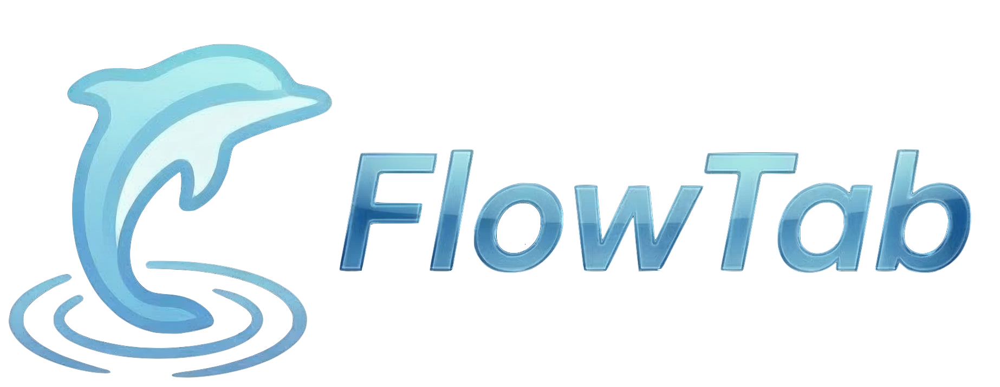
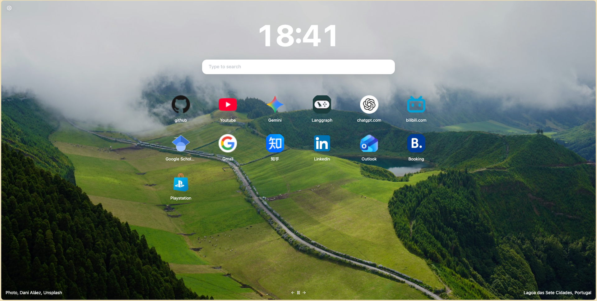

  

  A simple, personalized New Tab page for Chrome and Edge that keeps your data stored locally.

## Usage

Install dependencies with `npm install` before running the following scripts.

- `npm run dev[:target]` Local development server
- `npm run build[:target]` Production build

To develop with external services you will additionally need to signup for your own API keys
and enter them into your `.env` file. Get started by copying the example provided `cp .env.example .env`.

## Acknowledgements

FlowTab is based on the excellent [Tabliss](https://github.com/joelshepherd/tabliss) project.
Many thanks to its original author and contributors for their work and inspiration.
